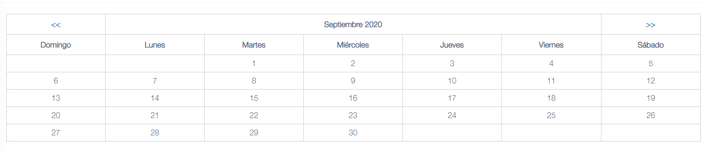

# Simple Calendar

[](https://www.php.net/)
[](LICENSE)

Framework-agnostic calendar generator for PHP 8.4+.

## Screenshot


## Highlights

- Pure PHP core
- Immutable fluent API
- Built-in translations loaded from PHP files
- Bootstrap 4 friendly default template
- Fully customizable templates through arrays or JSON

## Requirements

- PHP 8.4+

## Installation

```bash
composer require alexsoft/simple_calendar
```

## Basic Usage

```php
use Simple\Calendar\CalendarGenerator;
use Simple\Calendar\DateProvider;
use Simple\Calendar\TemplateManager;

$calendar = new CalendarGenerator(
    new TemplateManager(),
    new DateProvider(),
);

$html = $calendar->render(2026, 3);
```

The package does not ship any CSS. The default template only outputs simple HTML using familiar Bootstrap 4 classes.

## Fluent API

```php
use Simple\Calendar\CalendarGenerator;
use Simple\Calendar\DateProvider;
use Simple\Calendar\Enums\DayFormat;
use Simple\Calendar\TemplateManager;

$html = (new CalendarGenerator(
    new TemplateManager(),
    new DateProvider(),
))
    ->month(2026, 3)
    ->bootstrap4()
    ->dayFormat(DayFormat::Long)
    ->navigation('https://example.test/reports/daily-sales', true)
    ->events([
        10 => '<strong>Sales</strong>',
        15 => [
            [
                'title' => 'Total sales',
                'content' => '<table class="table table-sm"><tr><td>100.00</td></tr></table>',
                'attributes' => ['class' => 'sale-entry'],
            ],
        ],
    ])
    ->render();
```

## Preconfigured Generator

You can configure the generator once and then start a fluent chain from `month()`.

```php
use Simple\Calendar\CalendarConfig;
use Simple\Calendar\CalendarGenerator;
use Simple\Calendar\DateProvider;
use Simple\Calendar\Enums\DayFormat;
use Simple\Calendar\Enums\MonthFormat;
use Simple\Calendar\TemplateManager;

$config = new CalendarConfig(
    monthFormat: MonthFormat::Long,
    dayFormat: DayFormat::Long,
    showNavigation: true,
    useSegments: true,
    navigationUrl: 'https://example.test/reports/daily-sales',
    locale: 'es',
    eventHtml: '{event}',
);

$calendar = new CalendarGenerator(
    new TemplateManager(),
    new DateProvider(),
    $config,
);

$html = $calendar
    ->month(2026, 3)
    ->events([
        1 => '<strong>Ventas</strong>',
    ])
    ->render();
```

## Templates

Custom templates can be passed as arrays or JSON strings.

## Bootstrap 4 Default

```php
$html = (new CalendarGenerator(
    new TemplateManager(),
    new DateProvider(),
))
    ->month(2026, 3)
    ->render();
```

### Array Template

```php
$template = [
    'table_open' => '<div class="table-responsive"><table class="table table-bordered custom-calendar">',
    'heading_row_start' => '<tr>',
    'heading_previous_cell' => '<th><a href="{previous_url}">&lt;&lt;</a></th>',
    'heading_title_cell' => '<th colspan="{colspan}">{heading}</th>',
    'heading_next_cell' => '<th><a href="{next_url}">&gt;&gt;</a></th>',
    'heading_row_end' => '</tr>',
    'week_row_start' => '<tr>',
    'week_day_cell' => '<td>{week_day}</td>',
    'week_row_end' => '</tr>',
    'cal_row_start' => '<tr>',
    'cal_cell_start' => '<td data-fulldate="{fulldate}">',
    'cal_cell_start_today' => '<td class="today" data-fulldate="{fulldate}">',
    'cal_cell_content' => '<div class="day_num">{day}</div><div class="content">{content}</div>',
    'cal_cell_content_today' => '<div class="day_num highlight">{day}</div><div class="content">{content}</div>',
    'cal_cell_no_content' => '<div class="day_num">{day}</div>',
    'cal_cell_no_content_today' => '<div class="day_num highlight">{day}</div>',
    'cal_cell_blank' => '&nbsp;',
    'cal_cell_end' => '</td>',
    'cal_cell_end_today' => '</td>',
    'cal_row_end' => '</tr>',
    'table_close' => '</table></div>',
];

$html = (new CalendarGenerator(
    new TemplateManager(),
    new DateProvider(),
))
    ->month(2026, 3)
    ->template($template)
    ->render();
```

### JSON Template

```php
$template = json_encode([
    'table_open' => '<table class="table table-bordered">',
    'heading_row_start' => '<tr>',
    'heading_previous_cell' => '<th><a href="{previous_url}">&lt;&lt;</a></th>',
    'heading_title_cell' => '<th colspan="{colspan}">{heading}</th>',
    'heading_next_cell' => '<th><a href="{next_url}">&gt;&gt;</a></th>',
    'heading_row_end' => '</tr>',
    'week_row_start' => '<tr>',
    'week_day_cell' => '<td>{week_day}</td>',
    'week_row_end' => '</tr>',
    'cal_row_start' => '<tr>',
    'cal_cell_start' => '<td data-fulldate="{fulldate}">',
    'cal_cell_start_today' => '<td data-fulldate="{fulldate}">',
    'cal_cell_content' => '<div>{day}</div><div>{content}</div>',
    'cal_cell_content_today' => '<div><strong>{day}</strong></div><div>{content}</div>',
    'cal_cell_no_content' => '<div>{day}</div>',
    'cal_cell_no_content_today' => '<div><strong>{day}</strong></div>',
    'cal_cell_blank' => '&nbsp;',
    'cal_cell_end' => '</td>',
    'cal_cell_end_today' => '</td>',
    'cal_row_end' => '</tr>',
    'table_close' => '</table>',
], JSON_THROW_ON_ERROR);
```

## Events

`events()` accepts:

- `CalendarEventsByDay`
- `day => html`
- `day => [[title, content, attributes]]`
- `CalendarEvent`
- `CalendarEventData`

```php
$dailySale = [
    5 => "<table class='table table-bordered table-sm'><tr><td>Total</td><td>250.00</td></tr></table>",
    9 => [
        [
            'title' => 'Total sales',
            'content' => '<div>840.50</div>',
            'attributes' => ['class' => 'daily-total'],
        ],
        [
            'title' => 'Shipping',
            'content' => '<div>25.00</div>',
        ],
    ],
];

$html = (new CalendarGenerator(
    new TemplateManager(),
    new DateProvider(),
))
    ->month(2026, 3)
    ->navigation('https://example.test/reports/daily-sales', true)
    ->events($dailySale)
    ->render();
```

## Translations

The core ships with PHP file based translations in `src/lang`.

Included locales:

- `en`
- `es`

```php
$html = (new CalendarGenerator(
    new TemplateManager(),
    new DateProvider(),
))
    ->month(2026, 3)
    ->locale('es')
    ->render();
```

You can also point to your own translation directory:

```php
$html = (new CalendarGenerator(
    new TemplateManager(),
    new DateProvider(),
))
    ->month(2026, 3)
    ->locale('fr', __DIR__ . '/lang')
    ->render();
```

## Default Markup

The default template uses familiar Bootstrap 4 classes such as:
- `table`
- `table-bordered`
- `table-sm`
- `table-responsive`

The package does not inject styles. If your application does not use Bootstrap, provide your own template.

## Security Notes

- Event content is rendered as trusted HTML by design.
- Custom templates are rendered as trusted HTML by design.
- HTML attributes provided through event metadata are normalized and escaped before rendering.
- If event content comes from users, sanitize it before passing it to the package.
- If you use a custom translation directory, treat it as trusted application code because translation files are loaded as PHP.

## Testing

```bash
vendor/bin/phpunit
```

## License

This project is released under the [MIT License](LICENSE).
